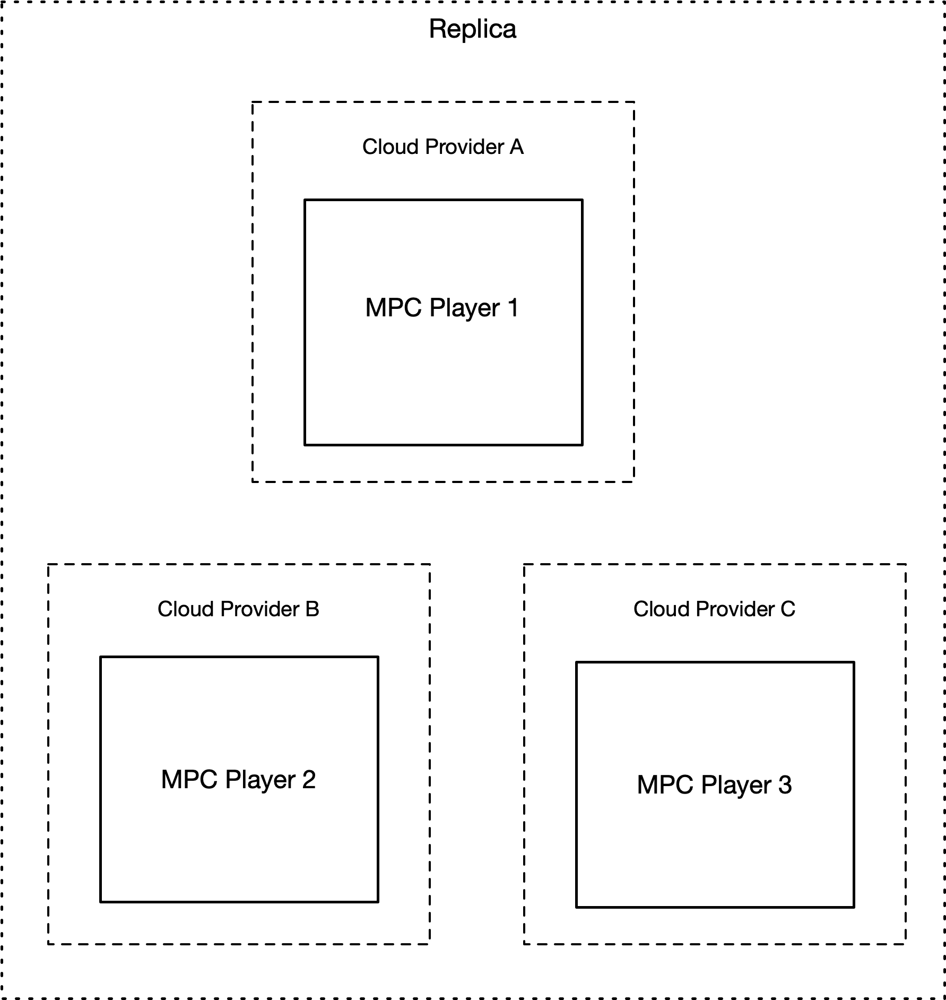

# SecureCRDT


This project implements a server/replica that supports multiple conflict-free replicated data types (CRDT) where data is encrypted with secret sharing and all operations are done using secure multiparty computation (SMPC) protocols. This replica, if correctly deployed, enures that a single malicious hosting provider does not learn the contents of the data in the CRDT.

Multiple replicas can be deployed with this project in an arbitrary network configuration. Currently, we support the secure implementation of the following CRDTs:

- Last Write Wins Register
- Max Value
- Positive Negative Counter
- Bounder Counter
- Grow Only Counter
- Grow Only Set

# How it Works


A SecureCRDT replica consists of three independent SMPC parties. Each party must be hosted in an independent trust domain (e.g: Cloud Provider).
A replica client can issue two operations:

1. an `update` operation to add or update a data value in a CRDT
2. a`query` operation to the retrieve the value in a CRDT

For each `update` operation, the client uses a secret share algorithm to encode the data and sends one share to each party. Therefore, no party has access to the plaintext value, and a malicious provider can not learn the contents of the CRDT.

To ensure data is consistent and to provide a correct result for `update` operations, the replica operates over the secret shared data by using multi-party protocols.



# Usage

## Dependencies

SecureCRDT is implemented and tested in Java 8. The project has the following dependencies:

- Java 8+
- Maven
- [SMPC Library](https://github.com/SecureCRDT/SMPC)


## Installation

This project is distributed as a Maven package. After installing all dependencies mentioned above, use the following command to create an executable JAR file.

```shell
$ mvn package
```

## Deployment

SecureCRDT can be deployed either in a `local` setting or in a `distributed` setting. In both settings, a single CRDT replica is initiated, which uses three SMPC parties, with each party deployed as an independent process. Additionally, each party is assigned a unique identifier and listens for requests on a pre-defined network port.

The main differences between both settings are the deployment configuration of the parties and how the parties communicate between each other. In the `local` setting, all SMPC parties must be deployed in the same host and communication is done over the local network. In a `distributed` setting, the SMPC parties must be deployed in independent hosts, and each party must be configured to connect to its peers.

### `Local` Deployment

Deploying a CRDT replica with a local deployment requires two steps.

First, initiate all SMPC players in different processes using the following command:


```shell
$ java -cp /$PATH-TO-PROJECT-HOME/SecureCRDT/target/SecureCRDT-1.0.jar pt.uporto.dcc.securecrdt.crdt.CrdtPlayer 0 local &

$ java -cp /$PATH-TO-PROJECT-HOME/SecureCRDT/target/SecureCRDT-1.0.jar pt.uporto.dcc.securecrdt.crdt.CrdtPlayer 1 local &

$ java -cp /$PATH-TO-PROJECT-HOME/SecureCRDT/target/SecureCRDT-1.0.jar pt.uporto.dcc.securecrdt.crdt.CrdtPlayer 2 local &
```

Secondly, initiate a CRDT client. This client provides an HTTP server that our [benchmark implementation](https://github.com/SecureCRDT/Benchmark) uses to measure the performance of the SecureCRDT system.

The client can be initiated by specifying which CRDT replica will be used. Replace $CRDT with one of the following types:

- register
- gcounter 
- pncounter 
- maxvalue
- minboundedcounter
- evergrowingset 
- setwithleakage

```shell
$ java -cp /$PATH-TO-PROJECT-HOME/SecureCRDT/target/SecureCRDT-1.0.jar pt.uporto.dcc.securecrdt.client.Client $CRDT local
```

### `Distributed` Deployment

The `distributed` deployment has an additional step to the `local` deployment. Before deploying the SMPC parties, you need to define their IPs and recompile the project.

First, start than by updating the IPs of the host machines used for each SMPC party in the [Standards.java](https://github.com/SecureCRDT/SecureCRDT/blob/main/src/main/java/pt/uporto/dcc/securecrdt/util/Standards.java) file. Afterwards, recompile the project.

```shell
$ mvn package
```

Secondly, initiate the SMPC players, one in each hosts in a distributed setting, using the following command. Replace the variable `$PLAYERID` with the respective player ID.
```shell
$ java -cp /$PATH-TO-PROJECT-HOME/SecureCRDT/target/SecureCRDT-1.0.jar pt.uporto.dcc.securecrdt.crdt.CrdtPlayer $PLAYERID distributed &
```

Finally, initiate the the CRDT proxy in an additional separate host.

```shell
$ java -cp /$PATH-TO-PROJECT-HOME/SecureCRDT/target/SecureCRDT-1.0.jar pt.uporto.dcc.securecrdt.client.Client $CRDT local
```

# Authors

The main author of the source code in this repository is [Pedro Jorge](https://github.com/0xpedrojorge). For any questions, please contact any of the following paper authors:

- [Bernardo Portela](mailto:bernardo.portela@fc.up.pt)
- [Hugo Pacheco](mailto:hpacheco@fc.up.pt)
- [Pedro Jorge](mailto:201706520@fc.up.pt)
- [Rogério Pontes](mailto:rogerio.a.pontes@inesctec.pt)
